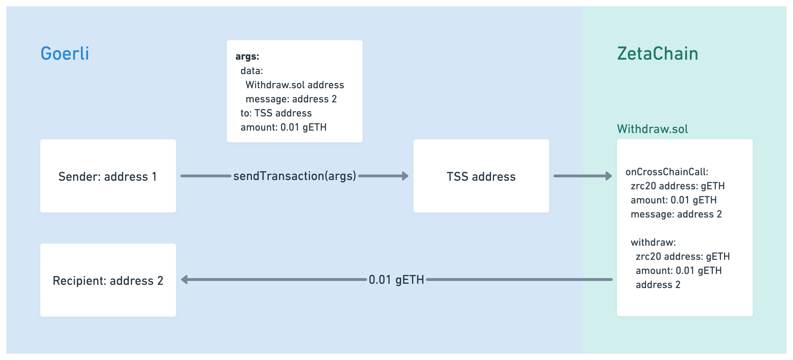

# Withdraw

In this tutorial you will write your first ZetaChain contract with cross-chain
functionality. The purpose of the contract is to demonstrate how an omnichain
contract on ZetaChain can be triggered from any connected network like Goerli or
Polygon Mumbai.

High-level overview:

1. A `Withdraw.sol` contract is created and deployed to ZetaChain.
2. A user transfers tokens to a specific address (called TSS) on the target
   network (Goerli, in this example). The `data` value of the token transfer
   transaction contains the address of the Withdraw contract on Zetachain and
   the recipient address back on the target network.
3. ZetaChain detects the token transfer transaction and triggers the
   `onCrossChainCall()` function of the Withdraw contract.
4. `onCrossChainCall()` uses ZRC20's `withdraw()` to initiate the process of
   transferring the tokens to the recipient address on the target network.



Note that the TSS address is a special address that is used to trigger
cross-chain transactions. The ZetaChain network has a TSS address on each
connected chain (like Goerli or Polygon Mumbai), and token transfers to this TSS
address can call any ZetaChain contract (which contract is called is determined
by the payload of the data field of the transaction).

## Set up your environment

```
git clone https://github.com/zeta-chain/template
```

Install dependencies:

```
cd template
yarn
```

## Creating the contract

Run the following command to create a new omnichain contract called `Withdraw`.
Pass the `recipient` parameter (`bytes32` by default) to the command to specify
the arguments to the cross-chain call.

```
npx hardhat omnichain Withdraw recipient
```

Modify the `onCrossChainCall` function to withdraw the tokens to the recipient:

```solidity title="contracts/Withdraw.sol"
    error SenderNotSystemContract();
    // highlight-start
    error WrongGasContract();
    error NotEnoughToPayGasFee();
    error InvalidZRC20Address();
    error ZeroAmount();
    // highlight-end

    function onCrossChainCall(
        address zrc20,
        uint256 amount,
        bytes calldata message
    ) external virtual override {
        if (msg.sender != address(systemContract)) {
            revert SenderNotSystemContract();
        }
        bytes32 recipient = abi.decode(message, (bytes32));
        // highlight-start
        if (zrc20 == address(0)) revert InvalidZRC20Address();
        if (amount == 0) revert ZeroAmount();

        (address gasZRC20, uint256 gasFee) = IZRC20(zrc20).withdrawGasFee();

        if (gasZRC20 != zrc20) revert WrongGasContract();
        if (gasFee >= amount) revert NotEnoughToPayGasFee();

        IZRC20(zrc20).approve(zrc20, gasFee);
        IZRC20(zrc20).withdraw(abi.encodePacked(recipient), amount - gasFee);
        // highlight-end
    }
```

First, define error types. These types, `WrongGasContract`,
`NotEnoughToPayGasFee`, `InvalidZRC20Address`, and `ZeroAmount`, replace general
reverts with detailed error messages, offering insights into what causes a
transaction to be reverted. By using custom error types, it becomes easier for
both developers and users to debug transactions that fail due to these specific
issues.

In the `onCrossChainCall` function, the first two conditions you need to set up
validate that the `zrc20` address isn't a null address and the amount being
transferred isn't zero. If either of these conditions isn't met, make the
contract execution revert with a specific error message (`InvalidZRC20Address`
or `ZeroAmount`, respectively).

Next, handle the gas fees for the transaction with a pair of conditions.
Retrieve the `gasZRC20` address and `gasFee` amount using the `withdrawGasFee`
method from the `IZRC20` interface. Then, check if the contract address for
withdrawing the gas fee matches the `zrc20` address. If it doesn't, an
`WrongGasContract` error is raised.

Also, verify that the `gasFee` isn't greater than or equal to the amount being
transacted. If it is, this suggests that the user doesn't have sufficient funds
to cover the gas fee for the transaction, resulting in a `NotEnoughToPayGasFee`
error.

Finally, approve the gas fee to be withdrawn from the `zrc20` address and
proceed with the withdrawal, passing the recipient address and the amount to be
sent, after the gas fee has been deducted. This step ensures the gas fee is
deducted before the cross chain transfer, safeguarding the contract from users
who might not have enough funds to cover the gas fee.

## Deploying the contract

Clear the cache and artifacts, then compile the contract:

```
npx hardhat compile --force
```

Use the standard deploy task to deploy the contract to ZetaChain:

```
npx hardhat deploy --network zeta_testnet
```

```
🔑 Using account: 0x1e89d05e9917e18c198b30d6728399FD63E236bB

🚀 Successfully deployed contract on ZetaChain.
📜 Contract address: 0x5E3229522BeFD3D9CD422Fd91f4273ed4EB2639a
```

## Interacting with the contract

Use the standard interact task to call the omnichain contract:

```
npx hardhat interact --network goerli_testnet --amount 0.5 --contract 0x5E3229522BeFD3D9CD422Fd91f4273ed4EB2639a --recipient 0x2c2d7aF555156eFB8Bfc3eBB0C41fE57D4D1C7c4
```

Where `--contract` is the contract address from the output of the `deploy` task
and `--recipient` is any address on the target network. You're using the
`goerli_testnet` network in this example, but you can use any other supported
testnet like `mumbai_testnet`.

```
🔑 Using account: 0x2cD3D070aE1BD365909dD859d29F387AA96911e1

Getting tss address from athens: goerli.

🚀 Successfully broadcasted a token transfer transaction on goerli network.
📝 Transaction hash: 0xc6b72c5cc7b7ec68e0853827eab8cead9664b951bfe66340bd2711e2abdf0013
```

You should be able to see the progress of the transaction being tracked on
ZetaChain. Once the transaction is finalized on ZetaChain, you should see a
token transaction to the recipient address on the target network.

Congratulations! You have successfully created and deployed the Withdraw
contract to ZetaChain, and executed a cross-chain transaction by sending tokens
to a TSS address on Goerli, which triggered a Withdraw contract call on
ZetaChain and withdrew the tokens to the recipient address on Goerli.

## Source Code

You can find the source code for the example in this tutorial here:

https://github.com/zeta-chain/example-contracts/tree/main/omnichain/withdraw/
